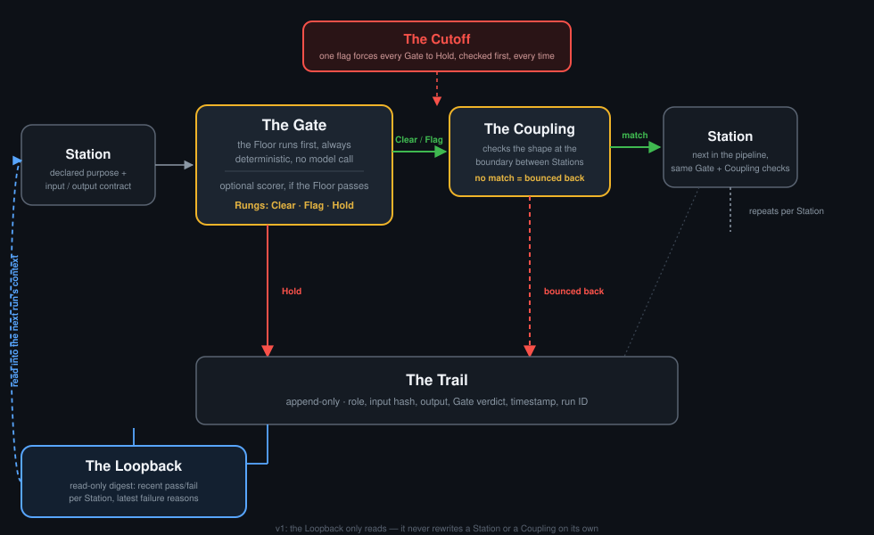

# minel-agent-framework

A small toolkit for building a multi-agent pipeline: **Stations** you define yourself, **Couplings** that hard-reject a bad handoff instead of coercing it, a **Gate** that runs a deterministic check before anything else gets to run, and a **Trail** + **Loopback** so a run leaves a real, readable history behind. Zero runtime dependencies. Zero API keys to run the bundled demo. No live model call anywhere in this repo's own demo path.

```
npm install
npm test      # 51 tests, node's built-in test runner, no dependencies to install
npm run demo  # runs the bundled document-review pipeline end to end
```

Under five minutes from a fresh clone, on Node 18+.

## Why this exists

Most multi-agent frameworks treat validation as something you bolt on to a model call if you remember to. This one makes the deterministic check structurally first: **the Floor runs before anything else in the pipeline can proceed, for every Station, and it cannot be skipped by forgetting to wire it in.** A schema mismatch at a handoff is a hard rejection by default, not a silent coercion. And the run's memory is a plain, greppable, append-only log — not a vector store — because a framework whose whole selling point is auditability shouldn't hand you memory you can't fully inspect.

None of the individual pieces (a role, a schema, a gate, a log) are novel to the field. What's here is a specific, consistent set of defaults: deterministic-first, hard-reject-at-the-boundary, plain-log-not-semantic-recall, applied the same way across all three.

## How it compares

| | **minel-agent-framework** | LangGraph | CrewAI | AutoGen |
|---|---|---|---|---|
| Deterministic pre-check before any model call | **mandatory, every Station** | opt-in (custom node) | opt-in (custom task) | opt-in (custom agent logic) |
| Handoff validation | **schema-checked, hard-reject** | typed state, no built-in reject-and-bounce | none built in | none built in |
| Memory | **plain append-only log, read-only digest** | checkpointer (pluggable, often a DB) | short/long-term memory (often vector-backed) | none built in by default |
| Kill switch | **one command halts every Gate** | none built in | none built in | none built in |
| Runtime dependencies | **zero** | several | several | several |
| Needs an API key to run the demo | **no** | usually | usually | usually |

This table describes defaults, not ceilings — every one of the alternatives can be configured toward the same guarantees. The point of this repo is that here they're the starting position, not an add-on.

## The five pieces

| Concept | What it is |
|---|---|
| **The Station** | A configured post in a pipeline: what it's for, what it needs handed to it, what it must hand out. Not a person, not a fixed persona. The framework ships zero built-in Stations — you define however many your project needs. |
| **The Coupling** | The shape an output must match to connect to the next Station. Checked at the boundary, bounced back rather than forced through if it doesn't fit. |
| **The Floor / the Rungs / the Cutoff** | The Gate. The Floor is the deterministic, non-model pre-check that runs first, always. Its verdict (and an optional pluggable scorer's, if the Floor passes) maps to the Rungs: Clear / Flag / Hold. The Cutoff is one command that forces every Gate to Hold, network-wide, instantly. |
| **The Trail** | An append-only JSON Lines log of every Station invocation: role, input hash, output, Gate verdict, timestamp, run ID. |
| **The Loopback** | A read-only digest built from the Trail (recent pass/fail rate per Station, recent failure reasons) that a future run can read into its own context. v1 never rewrites a Station or a Coupling on its own — it's read-only, on purpose. |



Full detail: [`docs/architecture.md`](docs/architecture.md). Full vocabulary: [`docs/naming.md`](docs/naming.md).

## Quick start: define your own pipeline

```js
import { runPipeline } from 'minel-agent-framework';

const stations = [
  {
    name: 'Extractor',
    purpose: 'pull structured facts out of raw text',
    input_contract: { type: 'object', required: ['text'], properties: { text: { type: 'string', minLength: 1 } } },
    output_contract: { type: 'object', required: ['facts'], properties: { facts: { type: 'array', items: { type: 'string' } } } },
  },
  {
    name: 'Summarizer',
    purpose: 'turn extracted facts into a short summary',
    input_contract: { type: 'object', required: ['facts'], properties: { facts: { type: 'array', items: { type: 'string' } } } },
    output_contract: { type: 'object', required: ['summary'], properties: { summary: { type: 'string', minLength: 1 } } },
  },
];

const executors = {
  Extractor: (input) => ({ facts: input.text.split('. ').filter(Boolean) }),
  Summarizer: (input) => ({ summary: input.facts.join('; ') }),
};

const result = await runPipeline({
  stations,
  executors,
  initialInput: { text: 'Node is single-threaded. Append is atomic on POSIX.' },
  trailPath: './data/trail.jsonl',
});

console.log(result.status); // "completed" | "halted" | "rejected"
```

Wire a real model call into any executor — the framework doesn't care what's inside one, only that it returns something matching the Station's declared `output_contract`.

## The bundled demo

Three Stations — **Drafter → Reviewer → Publisher** — a document-review pipeline. Every executor is a stubbed, deterministic function; none of them call a model or make a network request. `npm run demo` runs three scenarios so all three pipeline outcomes are visible in one pass:

```
=== Scenario: clean run ===
Status: completed
Final output: {"published":true,"url":"https://example.local/published/why-append-only-logs-are"}

=== Scenario: the Floor halts a thin draft ===
Status: halted
Halted at "Drafter": Floor rule "draft-length" failed: field "draft" length 4 is below minimum 10

=== Scenario: the Coupling rejects a malformed handoff ===
Status: rejected
Rejected at "Drafter": "Drafter" violated its own declared output_contract
  $.word_count: expected type "integer", got "string"

=== Loopback digest ===
Loopback digest (read-only, derived from the Trail):
- Drafter: 3 run(s), pass rate 0.667 (Clear 2 / Flag 0 / Hold 1)
    last Hold: Floor rule "draft-length" failed: field "draft" length 4 is below minimum 10 (2026-09-15T17:24:18.726Z)
- Reviewer: 1 run(s), pass rate 1 (Clear 1 / Flag 0 / Hold 0)
- Publisher: 1 run(s), pass rate 1 (Clear 1 / Flag 0 / Hold 0)
```

That's a real, captured run — not a mocked transcript. See `examples/document-review/` for the Station config, the Floor rules, and the stub executors.

## CLI

```
minel-agents demo                    run the bundled document-review demo
minel-agents cutoff on|off|status    engage / lift / inspect the Cutoff
minel-agents trail digest <path>     print a Loopback digest for a Trail file
```

## What v1 deliberately does not do

- No cadence or scheduling primitive. A pipeline here is role A's output becoming role B's input — no time dimension. A project that wants scheduling builds that layer on top.
- No autonomous self-editing from the Loopback. v1 ships the log and a read-only digest; it does not rewrite a Station, a Coupling, or a prompt on its own.
- No UI, no hosting, no auth, no multi-tenancy.
- No full JSON Schema implementation — `src/schema.js` supports a stated, bounded subset (`type`, `required`, `properties`, `additionalProperties`, `enum`, string length bounds, number bounds, array `items`/`minItems`). It's honest about that scope rather than claiming more.

## License

MIT — see [`LICENSE`](LICENSE).
